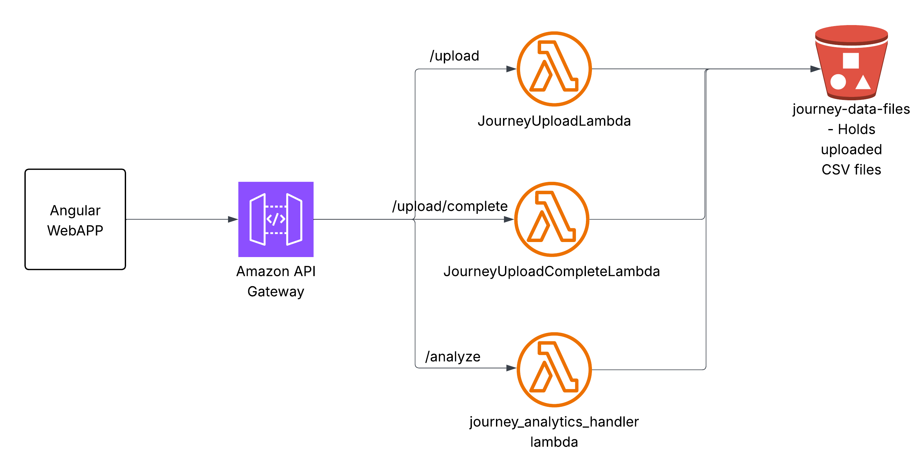

# Application README

## Overview
This backend provides:
- Multipart file upload to S3 (no presigned URLs)
- CSV-based Customer Journey analysis using Pandas
- Fully logged Python analysis engine
- REST API built via API Gateway
- Lambdas in Node.js (upload) and Python (analysis)

## Architecture
- **JourneyUploadLambda**  
  Handles initiating and uploading each chunk directly to S3.

- **JourneyUploadCompleteLambda**  
  Finalizes multi-part upload using `CompleteMultipartUpload`.

- **JourneyAnalyticsLambda**  
  Loads the CSV from S3, executes all analysis (Sankey, Markov, Funnels, etc.) and returns JSON.

- **API Gateway**  
  Resources:
  ```
  POST /upload --> JourneyUploadLambda
  POST /upload/complete --> JourneyUploadCompleteLambda
  POST /analyze --> journeyanalytics-lambda

  ```

## Folder Structure
```
ROOT
├── journey-analytics-ui/                 <-- Angular application
│   ├── src/app/
│   │   ├── components/
│   │   │   ├── overview/
│   │   │   ├── sankey/
│   │   │   ├── markov/
│   │   │   ├── funnel/
│   │   │   ├── lengths/
│   │   │   ├── heatmap/
│   │   │   └── top-journeys/
│   │   ├── services/
│   │   │   ├── journey-upload.service.ts
│   │   │   ├── analysis.service.ts
│   │   │   └── journey-state.ts
│   │   ├── app.ts / app.html
│   │   └── assets/
│   └── angular.json
│
├── journeyanalytics-lambda/              <-- Python analytics Lambda ZIP folder
│   ├── journey_analytics_handler.py
│   ├── journey_analysis.py
│   └── (ZIP BOTH files together for deployment)
│
├── JourneyUploadLambda.js
├── JourneyUploadCompleteLambda.js
│
├── package.json   <-- for JS Lambdas
│
└── README.md


```

## Packaging/Lambda Deployment Instructions for journeyanalytics-lambda

### 1. ZIP the below files:
```
journey_analytics_handler.py
journey_analysis.py
```

### 2. Create the Lambda using Python 3.10 runtime

### 3. Change the handler to journey_analytics_handler.lambda_handler

### 4. Add the lambda layer (Python Pandas / Wrangler)


This layer provides:
- pandas
- numpy
- pyarrow

supporting native dependencies. You do not add these libraries into the ZIP.
To add the layer, In the Lambda console:
- Go to your Lambda function (e.g., journey-analytics-lambda).
- Scroll to Layers.
- Click Add a layer → Specify an ARN.
- Paste:
```
arn:aws:lambda:us-east-1:336392948345:layer:AWSSDKPandas-Python310:7
```
- save
### 5. Lambda Configuration

#### Runtime
- **Python 3.10**
#### Handler
- **`journey_analytics_handler.lambda_handler`**
#### Memory
- **1024 MB or higher recommended**  
  (Pandas, NumPy, and CSV parsing benefit from additional memory)
#### Timeout
- **20–30 seconds recommended**  
  (Large datasets and Sankey/Markov preparation can take time)
#### Layers
Attach the AWS-provided Pandas layer as documented

## Ui Execution Flow

```
                    ┌─────────────────────────┐
                    │ journey-analytics-ui     │
                    │ (Angular Application)    │
                    └──────────┬──────────────┘
                               │
                               │ 1. User selects CSV
                               ▼
                    ┌─────────────────────────┐
                    │ JourneyUploadService     │
                    └──────────┬──────────────┘
                               │
        ┌──────────────────────┼───────────────────────────┐
        │ (1) POST /upload     │                           │
        │ Starts multipart     │                           │
        ▼                      │                           │
┌────────────────────┐         │                           │
│ JourneyUploadLambda │         │ (2) Upload chunks         │
└─────────┬──────────┘         │                           │
          │                    ▼                           │
          │           ┌──────────────────────┐             │
          │           │ UploadPart (repeated)│             │
          │           └──────────────────────┘             │
          │                                                │
          └────────────────────────────────────────────────┤
                               │ (3) POST /complete
                               ▼
                   ┌──────────────────────────┐
                   │ JourneyUploadCompleteLambda
                   │ Returns { bucket, key }
                   └───────────┬──────────────┘
                               │
                               │ startAnalysis(bucket, key)
                               ▼
                      ┌──────────────────────┐
                      │ AnalysisService      │
                      └─────────┬────────────┘
                                │ 4. POST /analyze
                                ▼
                   ┌──────────────────────────────────────┐
                   │ journey_analytics_handler.py         │
                   │ - Loads CSV from S3 (bucket/key)     │
                   │ - Uses journey_analysis.py (Pandas)  │
                   │ - Computes metrics, Sankey, Markov   │
                   └─────────────┬────────────────────────┘
                                 │ JSON Response
                                 ▼
                      ┌──────────────────────────────┐
                      │ JourneyStateService           │
                      │ result$.next(response)        │
                      └───────────┬───────────────────┘
                                  │
      ┌───────────────────────────┼──────────────────────────────────────────┐
      │                           │                                           │
      ▼                           ▼                                           ▼
┌────────────┐           ┌────────────────┐                      ┌────────────────────┐
│ Overview   │           │ Sankey         │                      │ Markov/Funnel/...  │
│ Component  │           │ Component      │                      │ Components         │
└────────────┘           └────────────────┘                      └────────────────────┘
      ▲                           ▲                                           ▲
      └────────────── UI updates (all subscribe to result$) ───────────────────┘


```

## Back End Architecture Diagram
